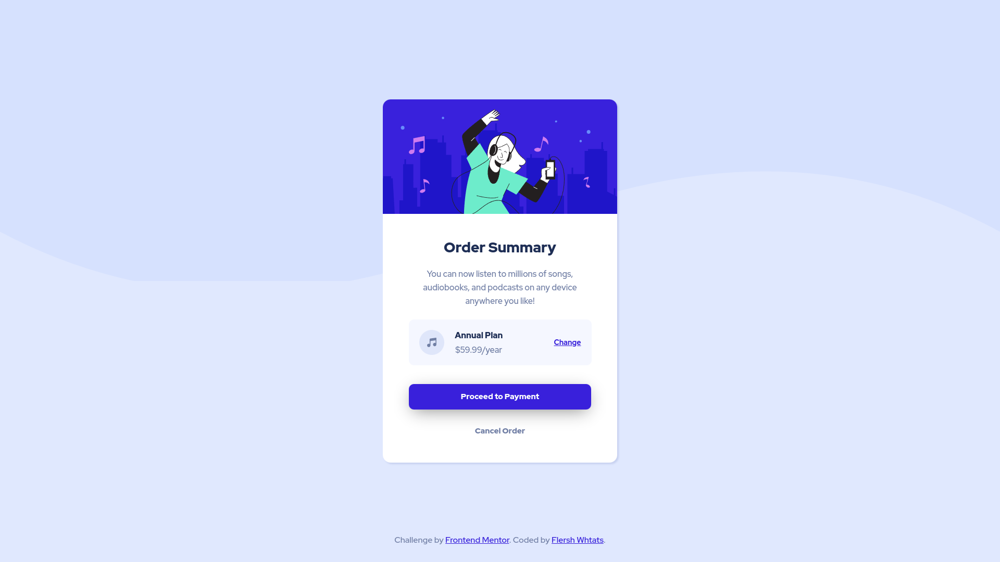

# Frontend Mentor - Order summary card

This is a solution to the [Order summary card challenge on Frontend Mentor](https://www.frontendmentor.io/solutions/order-summary-card-3XPMI3Dlxi). Frontend Mentor challenges help you improve your coding skills by building realistic projects. 

### Links

- Solution URL: [https://github.com/flershwhtat/order-summary](https://github.com/flershwhtat/order-summary)
- Live Site URL: [https://order-summary-flersh.netlify.app](https://order-summary-flersh.netlify.app)

### Built with

- HTML5
- CSS
- Flexbox

## Author

- Github - [flershwhtat](https://github.com/flershwhtat)
- Frontend Mentor - [@flershwhtat](https://www.frontendmentor.io/profile/flershwhtat)